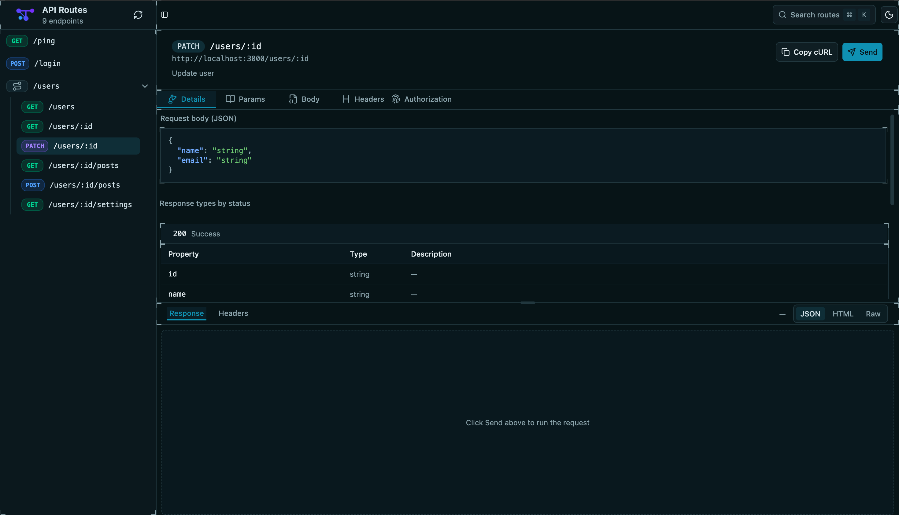

# Tracelet

  

Tracelet helps backend developers see request traces in minutes, without heavy observability setup.

🚧 **Work in progress.** Building in public.

---

## What is Tracelet?

Tracelet gives you request-level visibility into your API with minimal setup. You get logging and API call tracking, and add one JSON config to get live API docs that stay in sync with your routes. No heavy observability platforms or complex instrumentation.

- **Logging & tracking** – Log requests and track API calls with route context, payload shapes, and response status. See what your API is doing without extra tooling.
- **Live API docs** – Add one JSON value and you get docs from your routes, with params, body, and response types so you always see what your API accepts and returns.
- **Try it out in the browser** – Send real requests, edit params, headers, and body, and see responses right in the UI. Great for debugging and sharing with your team.
- **Lightweight** – No external services required. Run the docs UI locally or embed it where you need it.

  

*Tracelet docs UI: route list and API details with params, body, and response.*

---

## Documentation

| Doc | Description |
|-----|-------------|
| [SETUP](./docs/SETUP.md) | Prerequisites, clone, install |
| [BUILD](./docs/BUILD.md) | Building packages and packing SDKs |
| [INSTALLING PACKED SDKS](./docs/INSTALLING-PACKED-SDKS.md) | Install from `.tgz` in another project |
| [RUNNING LOCALLY](./docs/RUNNING-LOCALLY.md) | Run the app and docs UI |
| [PROJECT LAYOUT](./docs/PROJECT-LAYOUT.md) | Repository structure |
| [TROUBLESHOOTING](./docs/TROUBLESHOOTING.md) | Common issues |
| [EXTERNAL TESTING](./docs/EXTERNAL-TESTING.md) | Test outside the monorepo |
